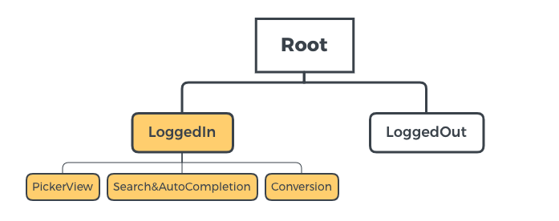

# SimpleExchangeRate

> Sample project using Reactive Framework(RxSwift, RxCocoa..) and RIBs

## API

[Exchange Rate API (no key required)](https://www.exchangerate-api.com/docs/documentation)

&nbsp;

## RIBs Tree 

&nbsp;

## Implementation

### view model injection

RIBs에서 DI 담당하는 component에서 가지고 있고

해당 RIB에서 Builder 가 build 시에 view model 을 view controller에 넣어준다

### vc - viewDidLoad & instantiate

- instatiate : storyboard에서 view controller 메모리 할당. subview 가 메모리 있을지는 장담할 수 없음

- viewDidLoad : subView 까지 메모리에 로드되었을 때 불리는 method

### 

## To Do

- <s>api 호출해서 data model 에 담기</s>
- <s>table view 에 data load 하기</s>
- <s>picker view event 에 맞춰서 호출 → table view reload</s>
- <s>TableView</s>
  - <s>RxDataSource 로 구현해보기</s>
  -  <s>section header 달고 싶음!</s>
- <s>네트워크 호출 → progress → 완료시 없어지는 기능 추가</s>
- Search
  - Text field filtering operator 사용해보기 (ex. throttle..)
- Conversion
  - Base & Target Currency 설정해서 변환할 수 있는 기능 구현하기